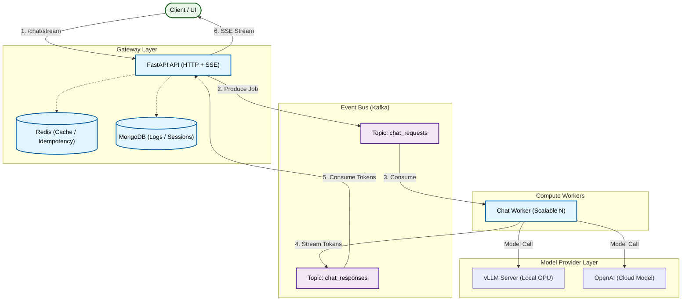

# CoreLLM Server

**Production-Ready, Scalable AI Backend (OpenAI + vLLM + Kafka + SSE)**

CoreLLM Server is a **model-agnostic, fully asynchronous AI backend platform** designed for **real-world, production-level workloads**.
It provides a clean, extensible architecture for chat-based AI systems that require:

* high concurrency
* low-latency streaming
* distributed processing
* clear separation between API and compute-heavy workloads
* predictable scaling

This is **not a demo** or a notebook script.
This is a backend foundation that can be deployed, scaled, and extended like a real AI product.

---

## What Is CoreLLM Server?

CoreLLM Server is a **model-agnostic chatbot backend** with clean abstractions and dependency-injected components.

It supports:

* **OpenAI models**
* **Local models via vLLM**
* **Switching between providers instantly**
* **Token-by-token SSE streaming**
* **Session-based chat state & short-term memory**

The architecture ensures:

* API never blocks
* Workers remain stateless and scalable
* All components (cache, logs, provider, broker) are replaceable via abstract interfaces

---

## Core Components

* **FastAPI** – HTTP + SSE streaming gateway
* **Kafka** – distributed event bus for request/response flow
* **MongoDB** – persistent logging, chat sessions, request history
* **Redis** – idempotency, caching, and concurrency safety
* **vLLM** – local GPU-powered LLM inference
* **OpenAI API** – cloud model support
* **Docker Compose** – reproducible, production-like setup

All major services follow **Dependency Injection + Abstract Classes**, making the system **extremely easy to extend**.

---

## High-Level Architecture

Client-facing API and compute-heavy workers are decoupled through Kafka, ensuring scalability and resilience.



---

## Chat Processing Flow (Streaming)

Each chat request runs through an event-driven pipeline:

### **1. API Layer**

* Validates request
* Creates or resumes chat session
* Logs request metadata
* Stores idempotency keys / state in Redis
* Publishes job to Kafka
* Returns immediately & opens SSE stream

### **2. Worker Layer**

* Consumes request from Kafka
* Selects model provider (vLLM or OpenAI)
* Generates **token-by-token output**
* Streams tokens to Kafka response topic

### **3. API Streaming Layer**

* Consumes response tokens
* Sends them to the client in real time via SSE

---

## 🧠 Why This Design Works

| Problem                 | Traditional Chatbots | CoreLLM Server                         |
| ----------------------- | -------------------- | -------------------------------------- |
| Long model latency      | API blocks           | Kafka decoupling                       |
| High concurrency        | Thread exhaustion    | Asynchronous + background workers      |
| Local GPU + Cloud Model | Hard to unify        | Provider abstraction                   |
| Scaling                 | Vertical only        | Horizontal workers                     |
| Logging & traceability  | Minimal              | Central MongoDB logging                |
| State management        | Mixed                | Redis for idempotency & session safety |
| Streaming               | Hard to build        | SSE + Kafka dispatcher                 |

---

## Extensibility (Dependency Injection)

Every major component is injected through abstract interfaces:

* `BaseModelProvider` → vLLM / OpenAI / any custom LLM
* `BaseCache` → Redis / custom
* `BaseLogger` → Mongo / custom (PostgreSQL, Elastic)
* `BaseMessageBroker` → Kafka / custom (RabbitMQ / NATS)

This means:

✔ swapping providers = **zero breaking changes**
✔ adding new services = **plug-in architecture**
✔ extending functionality = **clean and testable**

---

## ⚙️ Requirements

* Docker & Docker Compose
* For vLLM: NVIDIA GPU + **nvidia-container-toolkit**
* For OpenAI: API key

---

## 🔐 Environment Variables

Create a `.env` file: "cp .env.example .env" and add your OPENAI_API_KEY.

---

## ▶️ Run the System

```bash
docker compose build --no-cache
docker compose up

When you see "Application startup complete." you are ready to go.
```

Check running services:

```bash
docker compose ps
```

---

## 🧪 Test Chat Streaming

```bash
curl -N -G "http://localhost:8000/chat/stream" \
  --data-urlencode "prompt=Hello who are you?" \
  --data-urlencode "session_id=test-session-1" \
  --data-urlencode "user_id=test-user-1"
```

```bash
curl -N -G "http://localhost:8000/chat/stream" \
  --data-urlencode "prompt=Tell me how RAG systems work" \
  --data-urlencode "session_id=rag-test-1" \
  --data-urlencode "user_id=ozgur"
```

```bash
curl -N -G "http://localhost:8000/chat/stream" \
  --data-urlencode "prompt=What was my first question?" \
  --data-urlencode "session_id=rag-test-1" \
  --data-urlencode "user_id=ozgur"
```

---

## 📈 Scaling Workers

Add more workers to handle higher concurrency:

```bash
docker compose up --scale chat-worker=4
```

Kafka will automatically rebalance partitions.

---

## ⚠️ Notes

### GPU Support

vLLM requires:

* `nvidia-container-toolkit`
* CUDA-compatible GPU

### Security

By design, this template **does not include**:

* authentication
* rate limiting
* TLS
* quotas

Do not expose directly to the public internet.

---

## 🎯 Final Notes

CoreLLM Server is designed as:

* a **reference architecture**
* a **production-grade template**
* a **starting point for scalable AI systems**

---